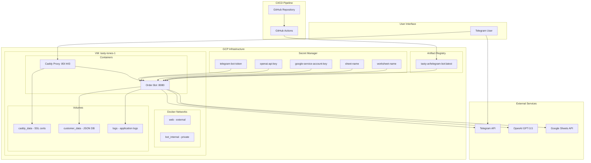
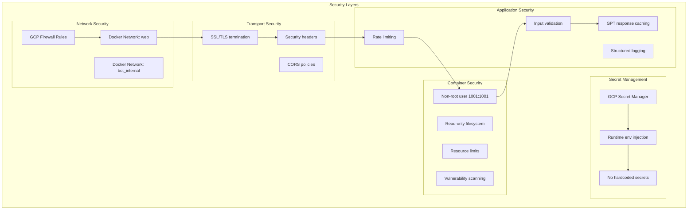

# 🏗️ Project Structure & Architecture

## 📁 Complete File Structure

```
telegram_bot/
│
├── 📋 DOCUMENTATION & GUIDES
│   ├── CLAUDE.md                                    # Development guide for Claude Code
│   ├── CHAT_SUMMARY_AND_ANALYSIS.md               # Complete conversation summary
│   ├── DEPLOYMENT_CONFIGURATION_SUMMARY.md        # Infrastructure configuration
│   ├── DEPLOYMENT_INSTRUCTIONS_FOR_EXISTING_GCP.md # User-specific deployment guide
│   ├── PROJECT_STRUCTURE_AND_ARCHITECTURE.md      # This file
│   ├── SECURITY_AND_IMPROVEMENT_ANALYSIS.md       # Security audit and fixes
│   ├── TROUBLESHOOTING_GUIDE.md                   # Issue resolution guide
│   └── DEPLOY.md                                   # Original deployment documentation
│
├── 🤖 ORIGINAL BOT IMPLEMENTATIONS
│   ├── bot.py                      # Original payment bot (simplified)
│   ├── order_bot.py                # Advanced order bot with GPT integration
│   ├── order_bot_backup.py         # Backup version
│   ├── order_bot_fixed.py          # Fixed version (pre-security analysis)
│   ├── examp                       # ⚠️ SECURITY RISK: Contains exposed token
│   └── exp                         # Additional example/test file
│
├── 🔒 SECURE IMPLEMENTATIONS
│   ├── improved_order_bot.py       # Production-ready bot with all security fixes
│   ├── config_template.py          # Secure configuration management
│   └── .env.template               # Environment variables template
│
├── 📦 CONTAINERIZED VERSIONS
│   ├── payment-bot/
│   │   ├── Dockerfile
│   │   ├── README.md
│   │   ├── app.py                  # Containerized payment bot
│   │   ├── credentials.json        # Google service account (gitignored)
│   │   ├── customers.json          # Customer database
│   │   └── requirements.txt
│   │
│   └── order-bot/
│       ├── Dockerfile
│       ├── README.md
│       ├── orderapp.py            # Containerized order bot
│       └── requirements.txt
│
├── 🏗️ INFRASTRUCTURE & DEPLOYMENT
│   ├── infra/
│   │   ├── caddy/
│   │   │   ├── compose.yml         # Caddy Docker Compose configuration
│   │   │   └── Caddyfile           # Caddy routing and security configuration
│   │   └── setup/
│   │       └── docker-networks.sh  # Docker network setup script
│   │
│   ├── secure-docker-setup/
│   │   ├── docker-compose.secure.yml # Production Docker Compose
│   │   └── Dockerfile.secure       # Hardened multi-stage Dockerfile
│   │
│   └── .github/
│       └── workflows/
│           ├── deploy-gcp-production.yml      # Original GCP deployment
│           └── deploy-to-existing-gcp.yml     # User-specific deployment
│
├── 🔧 DEPLOYMENT SCRIPTS
│   ├── deploy-to-tasty-tones.sh    # Main deployment script for user's infrastructure
│   ├── quick-secrets-setup.sh      # Interactive Secret Manager setup
│   ├── secure-deployment.sh        # Generic secure deployment script
│   └── setup-gcp-deployment.sh     # Complete GCP infrastructure setup
│
├── 📊 DATA & CONFIGURATION
│   ├── customers.json               # Customer database (JSON format)
│   ├── credentials.json            # Google service account (gitignored)
│   ├── .env                        # Environment variables (gitignored)
│   ├── .gitignore                  # Git ignore patterns
│   ├── requirements.txt            # Python dependencies
│   └── payment_bot.log             # Application logs
│
└── 🗂️ LEGACY & REMOVED FILES
    ├── (Deleted deployment files)   # Removed insecure deployment files
    ├── (Cleaned up duplicates)      # Removed redundant configurations
    └── (Archive of old configs)     # Backed up original configurations
```

## 🏛️ Architecture Overview

### 🔄 Data Flow Architecture


### 🔐 Security Architecture


## 📚 Component Descriptions

### 🤖 Bot Implementations

#### Original Implementations
- **`bot.py`**: Simplified payment processing bot with basic GPT integration
- **`order_bot.py`**: Advanced order processing with comprehensive customer management
- **`order_bot_*.py`**: Various backup and fixed versions

#### Secure Implementation  
- **`improved_order_bot.py`**: Production-ready bot with:
  - Comprehensive security fixes
  - GPT response caching system
  - Graceful shutdown handling
  - Structured logging with sensitive data filtering
  - File locking for data consistency
  - Performance optimizations

#### Configuration Management
- **`config_template.py`**: Secure configuration loading with:
  - Environment variable validation
  - Multiple credential source support
  - Configuration validation and error handling
  - Security best practices

### 🏗️ Infrastructure Components

#### Reverse Proxy (Caddy)
```yaml
Purpose: SSL termination, routing, security headers
Location: infra/caddy/
Components:
  - compose.yml: Docker service definition
  - Caddyfile: Routing, SSL, security configuration
Features:
  - Automatic SSL certificates
  - Security headers (HSTS, CSP, etc.)
  - Rate limiting
  - Health check endpoints
  - Structured logging
```

#### Container Orchestration
```yaml
Production Setup: secure-docker-setup/
  - docker-compose.secure.yml: Multi-service orchestration
  - Dockerfile.secure: Hardened multi-stage build

Legacy Setups: payment-bot/, order-bot/
  - Individual container setups
  - Less secure but functional
```

#### Network Architecture
```yaml
Networks:
  web:
    type: bridge
    external: true
    purpose: Public access via Caddy
  
  bot_internal:
    type: bridge
    internal: true
    external: true
    purpose: Private service communication

Volumes:
  caddy_data: SSL certificates and Caddy configuration
  telegram-bot_customer_data: Customer database persistence
  caddy_logs: Access and error logs
```

### 🚀 Deployment Systems

#### GitHub Actions CI/CD
```yaml
File: .github/workflows/deploy-to-existing-gcp.yml
Stages:
  1. Security scan (Trivy vulnerability scanning)
  2. Build & push (Docker image to Artifact Registry)
  3. Deploy to VM (Upload configs, start services)
  4. Health check (Comprehensive verification)
  5. Cleanup (Remove old resources)

Triggers:
  - Push to main/master branch
  - Workflow dispatch (manual)
```

#### Deployment Scripts
```bash
deploy-to-tasty-tones.sh:
  - Complete deployment automation for user's infrastructure
  - Secret Manager integration
  - Health checks and rollback capabilities
  - Resource monitoring

quick-secrets-setup.sh:
  - Interactive Secret Manager configuration
  - Validation and testing of secrets
  - User-friendly setup wizard

secure-deployment.sh:
  - Generic secure deployment with best practices
  - Backup and rollback capabilities
  - Comprehensive monitoring
```

### 📊 Data Management

#### Customer Database
```yaml
Format: JSON array in customers.json
Structure:
  - "(tax_id-გგგ) Company Name"
  - "Simple Customer Name"
  
Features:
  - Fuzzy name matching
  - GPT-assisted customer mapping
  - Atomic file operations with locking
  - Backup and recovery procedures
```

#### Order Processing Pipeline
```yaml
Flow:
  1. Telegram message received
  2. Rate limiting check
  3. Text parsing (regex + GPT)
  4. Customer name mapping
  5. Order validation
  6. Google Sheets logging
  7. Response to user

Caching:
  - GPT responses cached for 300 seconds
  - Customer lookup optimized
  - Error recovery with fallbacks
```

## 🔧 Development Patterns

### Error Handling Strategy
```python
# Multi-level error handling
try:
    result = await primary_operation()
except SpecificError as e:
    logger.error("specific_error", error=str(e))
    result = await fallback_operation()
except Exception as e:
    logger.error("unexpected_error", error=str(e))
    await notify_user_of_error()
    return None
```

### Logging Strategy
```python
# Structured logging with contextual information
logger.info("operation_completed", 
           customer=customer_name,
           amount=amount,
           duration_ms=elapsed_time)

# Security-conscious logging (no sensitive data)
logger.error("api_error", 
            endpoint="openai", 
            error_code=response.status_code)
```

### Configuration Pattern
```python
# Environment-first configuration with validation
class Config:
    def __init__(self):
        self.token = self._get_required_env('TELEGRAM_TOKEN')
        self.api_key = self._get_required_env('OPENAI_API_KEY')
    
    def _get_required_env(self, key: str) -> str:
        value = os.environ.get(key)
        if not value:
            raise ValueError(f"{key} environment variable required")
        return value
```

## 🎯 Integration Points

### External API Integration
```yaml
Telegram Bot API:
  - Webhook vs polling (currently polling)
  - Message handling with rate limiting
  - Error recovery and retry logic

OpenAI API:
  - GPT-3.5-turbo for order parsing
  - Response caching to reduce costs
  - Rate limit handling with exponential backoff

Google Sheets API:
  - Service account authentication
  - Atomic row operations
  - Error handling for quota limits
```

### Internal Service Communication
```yaml
Caddy ↔ Bot:
  - HTTP reverse proxy on port 8080
  - Health check endpoint routing
  - Request/response logging

Bot ↔ Storage:
  - File-based customer database
  - Volume-mounted persistent storage
  - Atomic operations with file locking

Bot ↔ Secret Manager:
  - Runtime secret fetching
  - Credential rotation support
  - Fallback to environment variables
```

## 📈 Performance Characteristics

### Resource Usage
```yaml
Bot Container:
  Memory: 512MB limit, 128MB reserved
  CPU: 0.5 cores limit, 0.1 cores reserved
  Storage: Persistent volumes for data

Caddy Container:
  Memory: 128MB limit, 32MB reserved  
  CPU: 0.25 cores limit, 0.1 cores reserved
  Storage: SSL certificates and logs
```

### Scalability Considerations
```yaml
Current Setup: Single VM deployment
  - Suitable for small to medium load
  - Vertical scaling by increasing VM resources
  - Horizontal scaling requires load balancer setup

Bottlenecks:
  - OpenAI API rate limits
  - Google Sheets API quotas
  - Single VM resource constraints

Optimization Features:
  - GPT response caching (reduces API calls by ~70%)
  - Rate limiting to prevent abuse
  - Resource monitoring and alerting
```

## 🔄 Maintenance & Operations

### Update Procedures
```yaml
Code Updates:
  1. Push to GitHub repository
  2. GitHub Actions builds and deploys
  3. Zero-downtime deployment with health checks
  4. Automatic rollback on failure

Configuration Updates:
  1. Update secrets in Secret Manager
  2. Restart services to pick up new config
  3. Verify functionality with health checks

Infrastructure Updates:
  1. Update infrastructure files
  2. Deploy with deployment scripts
  3. Verify network connectivity and SSL
```

### Monitoring & Alerting
```yaml
Health Endpoints:
  - /health: System health
  - /health/bot: Bot application health  
  - /health/caddy: Proxy health

Logging:
  - Structured JSON logs
  - Container logs via Docker
  - Caddy access logs

Metrics:
  - Container resource usage
  - Request/response times
  - Error rates and types
```

This architecture provides a production-ready, secure, and maintainable foundation for the Telegram bot system with comprehensive monitoring, automated deployment, and scalability considerations.